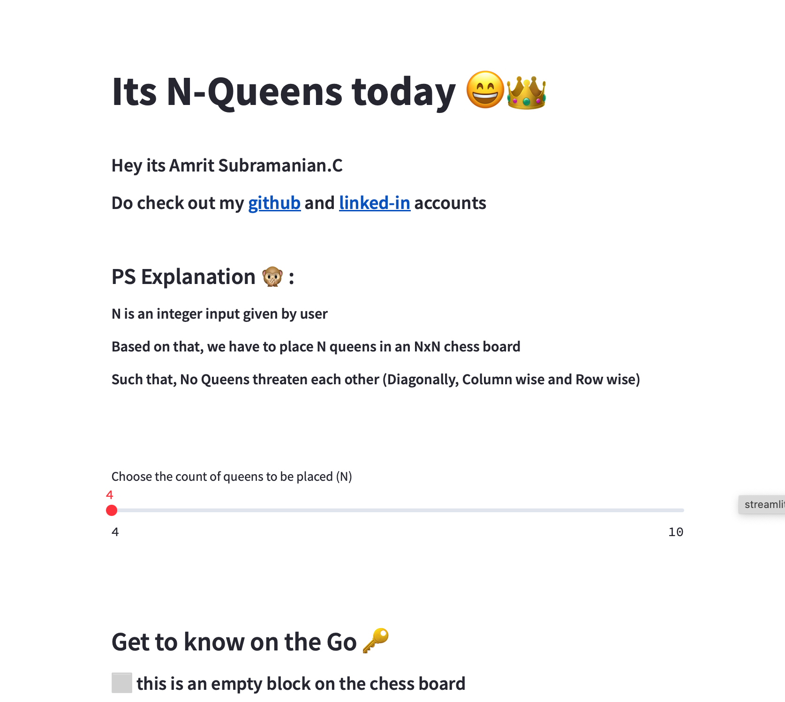
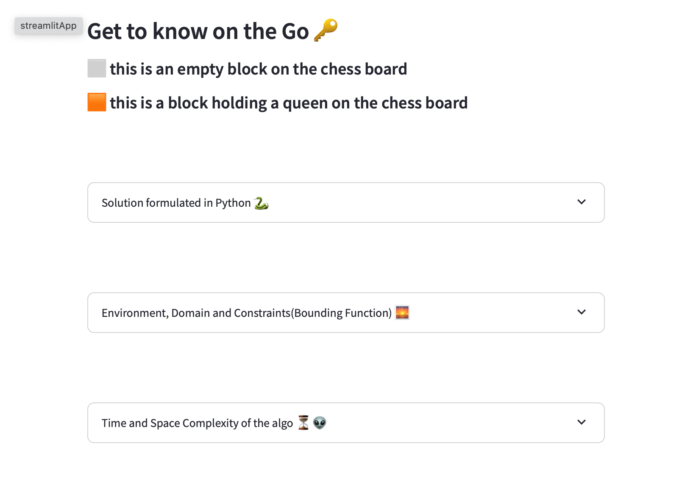
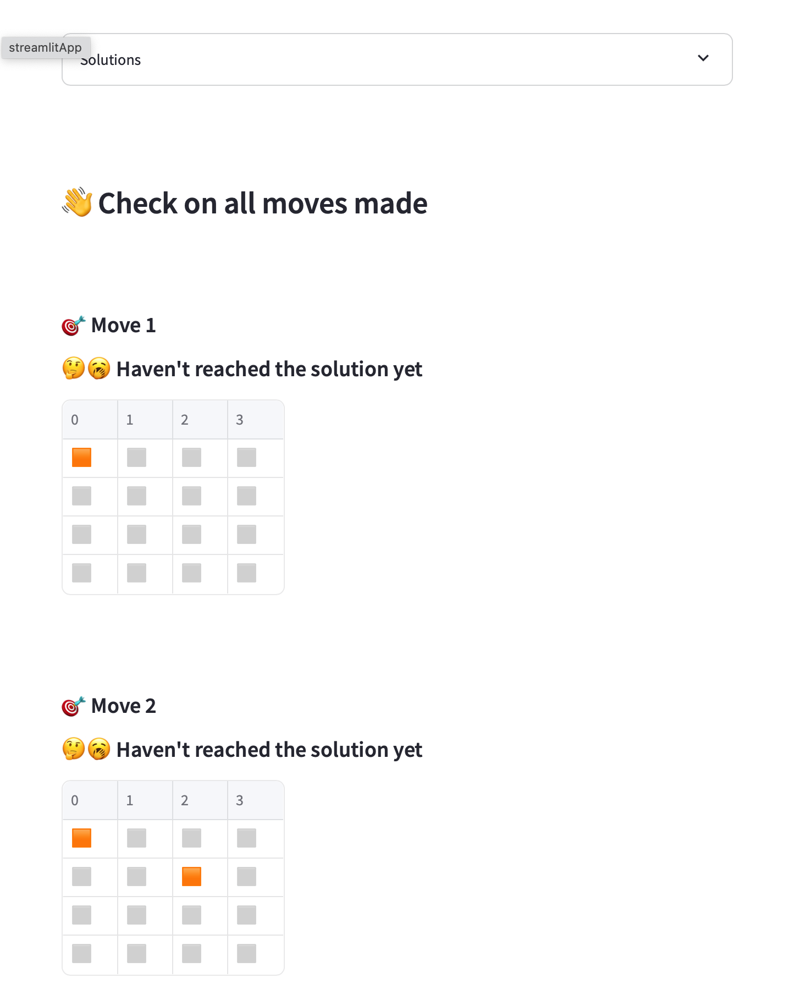

# N-Queens Problem Solver

The N-Queens problem solver is a Python-based application that uses backtracking and recursion to find solutions for placing queens on a chessboard. The interactive user interface is built with the Streamlit framework, allowing users to visualize and understand the solutions for different board sizes.

## Tech Stack

- **Python:** Programming language for the core implementation.
- **Streamlit:** Web app framework for creating an interactive documentation and user interface.

## Installation

To run the app locally, follow these steps:

```bash
pip install streamlit
git clone https://github.com/macromrit/Visualize-Nqueens
cd Visualize-Nqueens
streamlit run app.py
```

## Usage

1. **Slider for Number of Queens:**
   - Use the slider to select the number of queens (N) you want to place on the chessboard.

2. **Display Solutions:**
   - Visualize the placement of queens on the chessboard for each solution.
   - Solutions are generated using a combination of backtracking and recursion.

3. **Additional Information:**
   - Time and space complexity information is displayed for each solution.
   - Algorithmic explanation is provided for better understanding.
   - Description on Domain, Environment and Constraints(Bounding Function) of this problem
  
## Applications Usage Demo

### **Start of with adjusting the slider to number of queens needed**<br>
   <br>
### **Get access to python snippet which solves nqueens and other info like Space Complexity, Time complexity and more...**<br>
   <br>
### **Scroll thorugh the solutions and steps involved in solving it to get a good grasp of this problem**<br>
   <br>

## Get in touch with me, (I'm Macromrit)
**Contact Information:**
   - Email: amritsubramanian.c@gmail.com
   - LinkedIn: [Amrit Subramanian](https://www.linkedin.com/in/macromrit)
   - GitHub: [Macromrit](https://github.com/macromrit)

